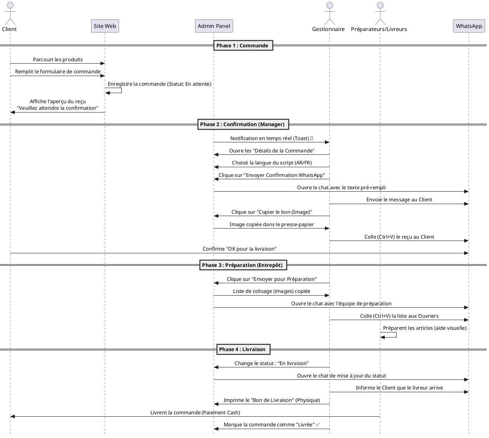

# Guide du Flux de Travail — Matjar El Kotobia ⚡

Ce document simule le parcours complet d'une commande, de l'arrivée du client sur le site jusqu'à la livraison finale. Il explique quoi faire, quoi imprimer et comment s'organiser professionnellement.

## 1. Diagramme de Séquence UML (PlantUML)

---

## 2. Simulation Étape par Étape

### Étape 1 : La Commande du Client
*   **Action du Client :** Le client sélectionne ses produits et valide son panier.
*   **Affichage :** Une page de succès s'affiche avec une image générée de son reçu. On lui demande de **ne rien faire** et d'attendre votre contact.
*   **Pourquoi ?** Pour garder le contrôle total et éviter que le client n'envoie des captures d'écran de mauvaise qualité ou des messages désordonnés.

### Étape 2 : Réception Admin (Notifications)
*   **Action Manager :** Vous êtes sur votre tableau de bord admin. Une notification **orange** apparaît en haut à droite dès que la commande est passée.
*   **Organisation :** Cliquez sur "Voir la commande" immédiatement pour ne pas faire attendre le client.

### Étape 3 : Confirmation Professionnelle
1.  **Script WhatsApp :** Choisissez "AR" ou "FR". Cliquez sur "Envoyer Confirmation". Cela ouvre WhatsApp avec un texte poli : *"Bonjour [Nom], nous avons reçu votre commande #123..."*
2.  **Preuve Visuelle :** Revenez sur l'admin, cliquez sur **"Copier le bon (Image)"**. Allez sur WhatsApp, faites **Ctrl+V** (Coller) et envoyez.
*   **Résultat :** Le client reçoit un message texte pro + une image nette de son reçu. Il se sent en confiance.

### Étape 4 : Préparation en Magasin (Le Picking)
*   **Action :** Une fois que le client a dit "Oui", cliquez sur **"Envoyer en Préparation"**.
*   **Le "Bon de Préparation" :** Le système génère une liste avec les **photos des produits** et les quantités en **GRAS**.
*   **Transmission :** L'image est copiée automatiquement. Collez-la dans votre groupe WhatsApp "Ouvriers" ou envoyez-la au préparateur.
*   **Avantage :** Même un ouvrier qui ne sait pas lire les noms peut préparer la commande grâce aux images.

### Étape 5 : Livraison et Suivi
1.  **Status Update :** Changez le statut en "En cours de livraison". Une fenêtre WhatsApp s'ouvre pour prévenir le client : *"Votre commande arrive !"*.
2.  **Papier Physique :** Cliquez sur "Imprimer le Bon de Livraison". C'est une version simplifiée sans photos, idéale pour le livreur et pour la signature du client.
3.  **Encaissement :** Le livreur récupère l'argent (COD).
4.  **Clôture :** Passez la commande en "Livrée" dans l'admin pour vos statistiques.

---

## 3. Checklist de ce qu'il faut "Produire"

| Document | Format | Destinataire | Utilité |
| :--- | :--- | :--- | :--- |
| **Reçu Client** | Image (PNG) | Client | Confirmation visuelle et confiance. |
| **Script Confirmation** | Texte WA | Client | Accueil poli et rappel du numéro de commande. |
| **Bon de Préparation** | Image (PNG) | Équipe / Magasin | Préparation rapide et sans erreur (avec photos). |
| **Bon de Livraison** | Papier (A4/A5) | Livreur / Client | Preuve de livraison physique et signature. |
| **Notification Statut** | Texte WA | Client | Suivi en temps réel pour rassurer le client. |

---

## 4. Conseils d'Organisation
*   **Garder l'onglet Admin ouvert :** Le système vérifie toutes les 10 secondes les nouvelles commandes.
*   **Utiliser WhatsApp Web :** C'est beaucoup plus rapide pour coller les images (Ctrl+V) que sur un téléphone.
*   **Photos de produits :** Assurez-vous que chaque produit a une image dans l'admin, car elle apparaîtra sur le bon de préparation des ouvriers.
