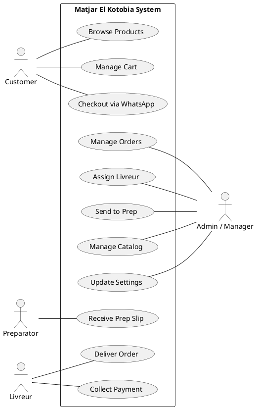
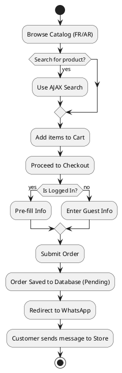
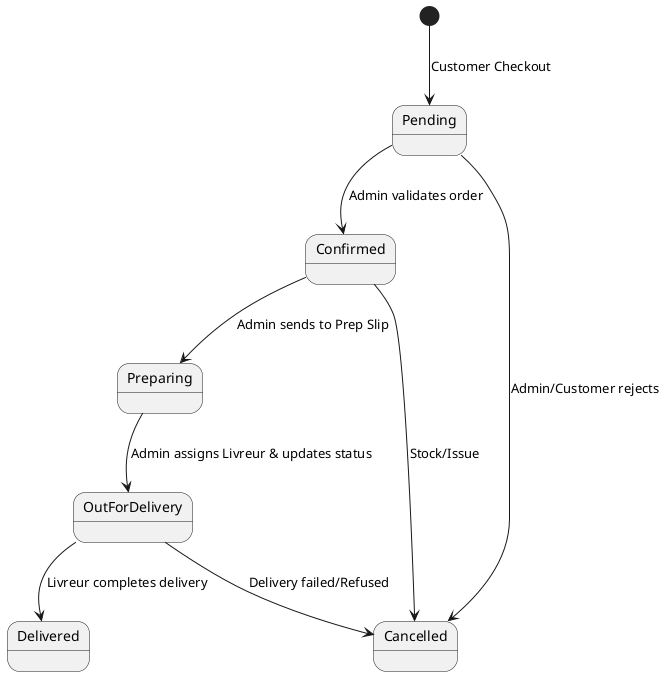
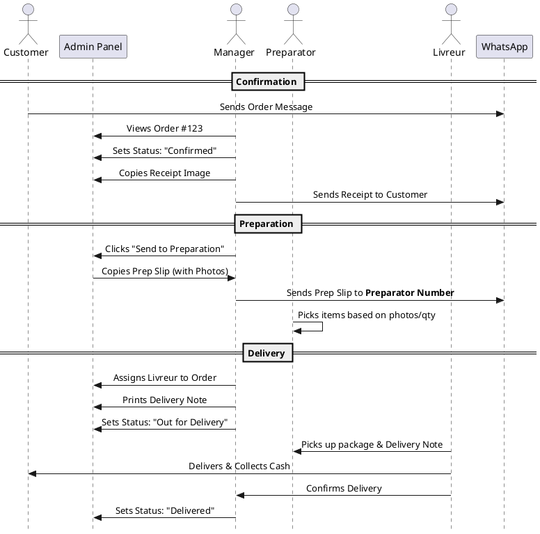

# Ultimate Workflow Guide — Matjar El Kotobia ⚡

This document provides a comprehensive overview of the "Matjar El Kotobia" ecosystem, detailing the roles, responsibilities, and technical flows from order placement to final delivery.

---

## 1. System Roles & Responsibilities

| Role | Responsibilities | Key Tools |
| :--- | :--- | :--- |
| **Customer** | Browse products, manage cart, place orders via WhatsApp. | Frontend Website, WhatsApp |
| **Admin / Manager** | Confirm orders, assign delivery personnel, manage catalog/settings. | Admin Panel, WhatsApp Web |
| **Preparator (Worker)** | Receive picking lists, prepare physical packages. | WhatsApp (Preparation Number) |
| **Livreur (Delivery)** | Pick up packages, deliver to customers, collect payment (COD). | Admin Order Printout, WhatsApp |

---

## 2. Visual Workflows (PlantUML)

### 2.1 Use Case Diagram (System Boundaries)

### 2.2 Customer Order Journey (Activity Diagram)

### 2.3 Order Lifecycle (State Machine)

### 2.4 Staff Collaboration (Sequence Diagram)

---

## 3. Step-by-Step Operations

### Phase 1: Customer Actions
1. **Selection:** Customer adds items. Minimum order amount is checked via AJAX.
2. **Checkout:** Form captures delivery details (Name, Phone, Address, Neighborhood).
3. **Handover:** System saves order and opens WhatsApp with a formatted summary.

### Phase 2: Manager Actions (Control Center)
1. **Monitoring:** Watch the Admin Dashboard for "Pending" alerts.
2. **Confirmation:** Use the **Confirmation WhatsApp** button to send a polite script.
3. **Visualization:** Click **"Copy Receipt"** (Image) and paste it into the customer's chat for a professional look.

### Phase 3: Warehouse & Preparation
1. **The "Prep Slip":** Click **"Send to Preparation"**. This generates a visual list (Item Name + Large Photo + Qty).
2. **Routing:** The image is copied, and a WhatsApp window opens to the **Preparation Worker's Number** (configured in Settings).
3. **Zero Error:** The worker prepares the bag using photos, reducing mistakes even if they can't read the product names perfectly.

### Phase 4: Logistics & Delivery
1. **Assignment:** Select a `Livreur` from the list in Order Details.
2. **Paper Trail:** Click **"Order Print"** to get a physical delivery note for the driver.
3. **Tracking:** Update status to **"Out for Delivery"**. The customer receives an automated WhatsApp update.
4. **Closing:** Once the driver returns with the cash, mark as **"Delivered"**.

---

## 4. Key Configuration
To ensure this workflow functions, verify the following in **Admin > Settings**:
* **Store WhatsApp:** The main number for customer contact.
* **Preparation Worker Number:** The number of the employee in charge of packing.
* **Livreurs:** Add your delivery team members in the **Livreurs** section.
